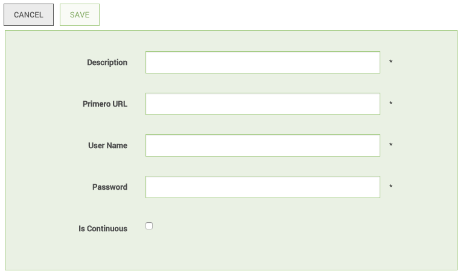

Introduction
============

### Why sync servers:

Syncing servers allows you to give and receive updated or new cases or
tracing requests. This is imperative in situations when there are
multiple local installers working on the same population.

### Continuous vs Manual Syncing:

There are two different kinds of syncing, a manual process to sync data
and an automated, real-time sync within the system.

### Built-in Conflict Resolution:

Concerns around syncing information arise in the case that two users on
two instances are editing the same record. Primero is built to merge
this information, except for in situations where the exact same form
field is edited in two locations. In which case, the system accepts the
more recent update as the correct information and will sync that
information across all applicable instances.

Configure a New Server
======================

To navigate to the Server configuration to create or sync servers,
select **SYNC** within the Header Navigation as seen below:

Once there, select the CONFIGURE A SERVER button below located in the
Actions Header. This will redirect you to a form to configure a new
server.

On this form, you must name the new server in the Description field, add
it’s full URL. For example, if the address I am using is
“test.primero.org,” the full URL would be “https://test.primero.org” including the "https://" at the beginning
Then, you must enter the database (not Primero!) administrator username
and password to create the server.

The “Is Continuous” checkbox is to select whether or not you want your
instance to continuously sync with the remote server.

Troubleshooting a Failed Synchronization
----------------------------------------

The syncing process is currently affected by machine performance and
connectivity, so failures are possible. If a sync fails, the first step
is to attempt to import the same file again. If a sync continues to
fail, confirm the following:

-   Network connectivity is good.

-   Server information is correct

-   Continuous is not checked

If you are syncing from a hosted Primero instance, refer to the Hosted
Primero Instance Technical Deployment for additional debugging specific
to VirtualBox.

If additional issues arise, contact your site administrator for
assistance.
